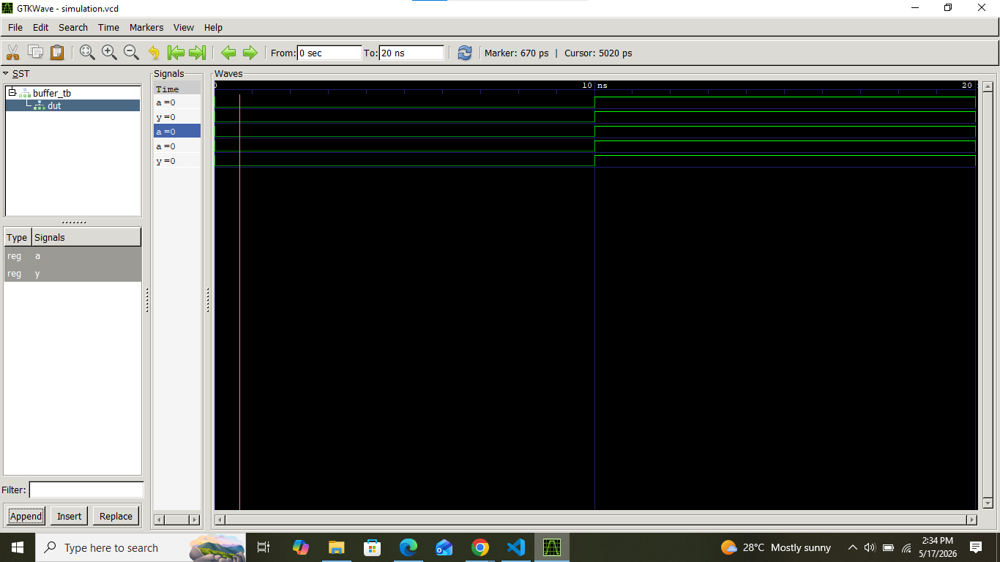

# Lab 1: Introduction to VHDL Programming and Simulation of a Buffer

## Objective
To implement, simulate, and verify the structural functionality of a basic digital Buffer using VHDL and GHDL simulation tools.
To learn the key components and fundamentals of a VHDL design.

## Theory
A buffer is a digital logic gate whose output follows its input exactly (Y = A). It passes the signal value unchanged and is structurally utilized for signal amplification or isolation within computer architectures.

## Verification & Discussion
The behavioral simulation was executed via GHDL across a 30 ns time window. The output trace confirms that the output logic tracks the input stimulus synchronously across the entire timeline. When the input transitions, the output matches instantly, verifying correct gate implementation. Since the output changes state immediately whenever the input changes, the circuit works correctly.

## Output Waveform
