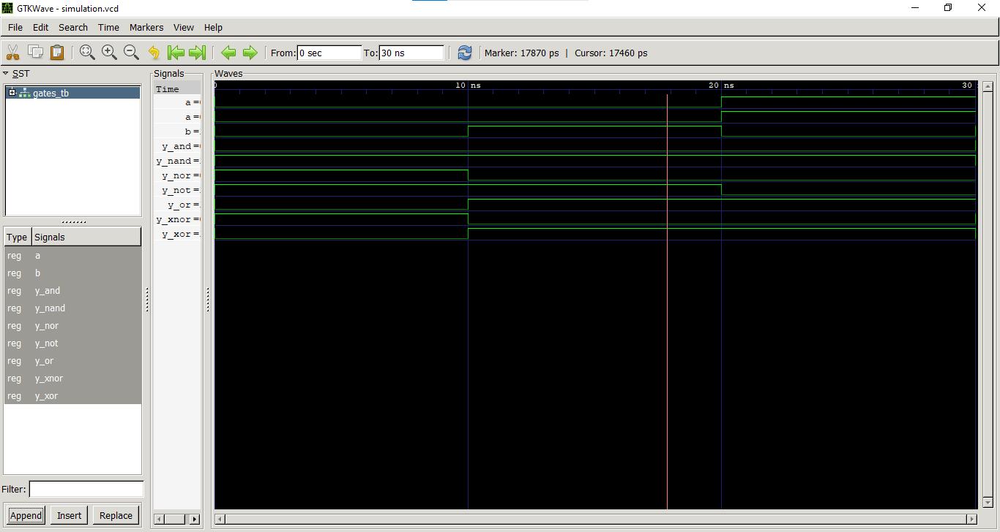

# Lab 2: VHDL Code for Realizing Logic Gates

## Objective
- To write VHDL code for basic logic gates: AND, OR, NOT, NAND, NOR, XOR, and XNOR.  
- To simulate each gate and verify its truth table using GTKWave.

---

## Theory
Logic gates are the fundamental building blocks of all digital circuits. Each gate performs a basic Boolean operation on one or more binary inputs to produce a single binary output.
In VHDL, logic gates are implemented using logical operators that describe the relationship between inputs and outputs. By writing VHDL code and simulating it, we can observe how each gate behaves according to its truth table. GTKWave is used to visualize simulation waveforms and verify whether the output matches the expected result.

The following logic gates are commonly used:

| Gate | VHDL Operator | Boolean Expression |
|------|---------------|-------------------|
| AND | `and` | Y = A · B |
| OR | `or` | Y = A + B |
| NOT | `not` | Y = A̅ |
| NAND | `nand` | Y = (A · B)̅ |
| NOR | `nor` | Y = (A + B)̅ |
| XOR | `xor` | Y = A ⊕ B |
| XNOR | `xnor` | Y = (A ⊕ B)̅ |

### Brief Description of Logic Gates

- **AND Gate:** Produces output `1` only when both inputs are `1`.  
- **OR Gate:** Produces output `1` if at least one input is `1`.  
- **NOT Gate:** Produces the complement (inverse) of the input.  
- **NAND Gate:** Produces the inverse of the AND gate output.  
- **NOR Gate:** Produces the inverse of the OR gate output.  
- **XOR Gate:** Produces output `1` when inputs are different.  
- **XNOR Gate:** Produces output `1` when inputs are the same.

---

## Output
Below is the verified timing waveform showing the transitions of all seven logic gates across the testbench stimuli:

---

## Discussion and Conclusion
In this lab session, individual dataflow VHDL entities were developed for all seven primitive digital logic components. A comprehensive testbench (`GATES_TB`) was constructed to systematically inject all possible binary input combinations over a 40 ns timeline. 

The resulting waveform simulation generated in GTKWave perfectly aligns with the mathematical truth tables for each logic block. For instance, the XOR output correctly pulses high when the inputs transition to mismatched states, while the XNOR responds conversely. In conclusion, the structural behavioral models were successfully compiled and verified using open-source EDA tools (GHDL/GTKWave).