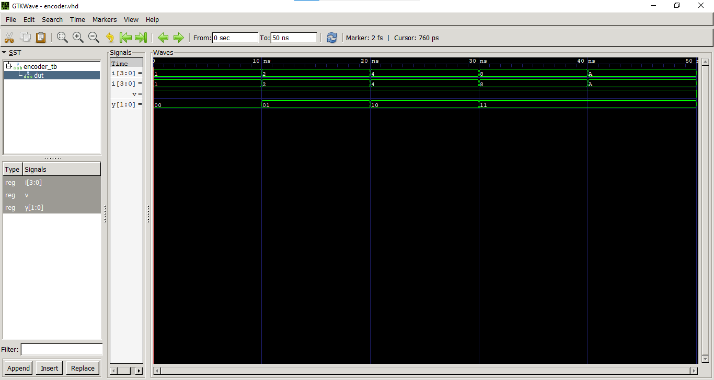
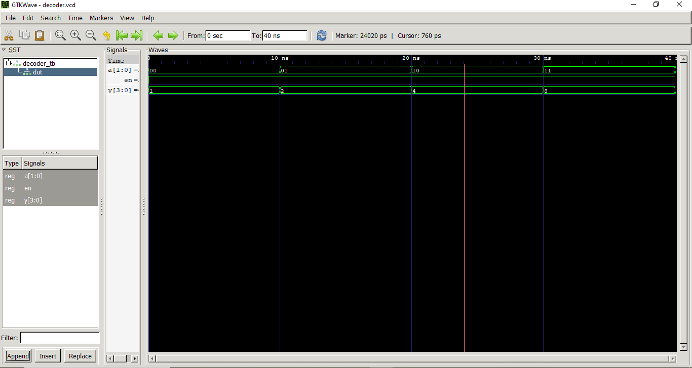

# Lab 3: VHDL Code for Combinational Circuits (Encoder and Decoder)

## Objective
* To design and simulate a 4-to-2 priority encoder in VHDL.
* To design and simulate a 2-to-4 decoder in VHDL.

## Theory

### Encoder
An encoder converts $2^n$ input lines into an $n$-bit binary code. Only one input is active (HIGH) at a time. A 4-to-2 encoder has 4 inputs (I0–I3) and produces a 2-bit output (Y1Y0).

A **priority encoder** handles the case where multiple inputs are high simultaneously by giving priority to the highest-numbered active input. If an input with a higher priority is asserted, all other concurrent inputs with lower priority are ignored. This design also includes an extra output signal called **Valid (V)**. The Valid bit acts as an idle status indicator; it is driven HIGH ($1$) whenever at least one input line is active, allowing the system to distinguish between a genuine $00$ binary code input and a state where no inputs are active at all.

### Priority Encoder Truth Table (4-to-2)

| I3 | I2 | I1 | I0 | Y1 | Y0 |
|----|----|----|----|----|----|
| 0  | 0  | 0  | 1  | 0  | 0  |
| 0  | 0  | 1  | X  | 0  | 1  |
| 0  | 1  | X  | X  | 1  | 0  |
| 1  | X  | X  | X  | 1  | 1  |

### Decoder
A decoder converts an $n$-bit binary input into one of $2^n$ output lines. A 2-to-4 decoder has a 2-bit input (A1A0) and 4 output lines (Y0–Y3). Exactly one output is HIGH at a time.

This circuit also incorporates an **Enable (EN)** control signal. When the Enable input is active (HIGH), the decoder interprets the 2-bit input binary combination and drives the corresponding distinct output line HIGH while keeping the other lines LOW. If the Enable signal is de-asserted (LOW), the internal logic gates are inhibited, forcing all four output channels to remain completely inactive ($0000$) regardless of the binary values applied to the inputs.

### 2-to-4 Decoder Truth Table

| A1 | A0 | Y3 | Y2 | Y1 | Y0 |
|----|----|----|----|----|----|
| 0  | 0  | 0  | 0  | 0  | 1  |
| 0  | 1  | 0  | 0  | 1  | 0  |
| 1  | 0  | 0  | 1  | 0  | 0  |
| 1  | 1  | 1  | 0  | 0  | 0  |

## Code Files
* `encoder_4to2.vhd` - 4-to-2 Priority Encoder Design File
* `encoder_tb.vhd` - Priority Encoder Testbench File
* `decoder_2to4.vhd` - 2-to-4 Decoder Design File
* `decoder_tb.vhd` - Decoder Testbench File

## Output
The simulation behavior was verified using GHDL and visualized with GTKWave timing diagrams. The simulated waveforms precisely follow the truth tables specified in the lab manual.

### 1. Priority Encoder Simulation Waveform

### 2. Decoder Simulation Waveform

## Discussion and Conclusion
In this lab exercise, combinational logic circuits for a 4-to-2 Priority Encoder and a 2-to-4 Decoder were successfully modeled and simulated using VHDL. Through tracking behavioral modeling methods like `case` and `when` conditional statement mappings, we observed how hardware prioritizes parallel data lines or expands encoded lines into independent signals.

The testbench configurations confirmed that adding control lines like the Valid status bit ($V$) prevents systemic ambiguity when no inputs are driven, and the Enable pin ($EN$) reliably acts as a global safety or master switch over output channels. Ultimately, the compiled waveforms cleanly matched our target hardware truth tables, demonstrating full logic correctness.
