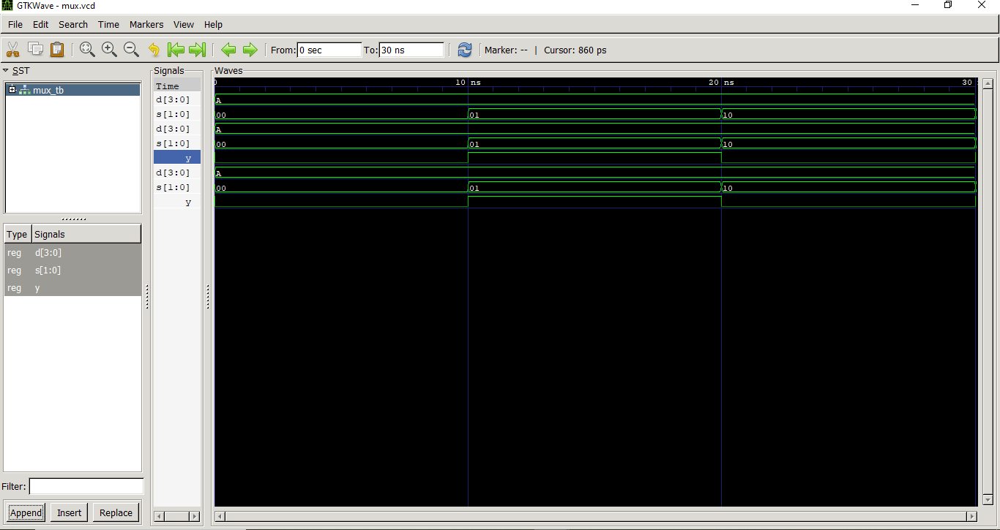
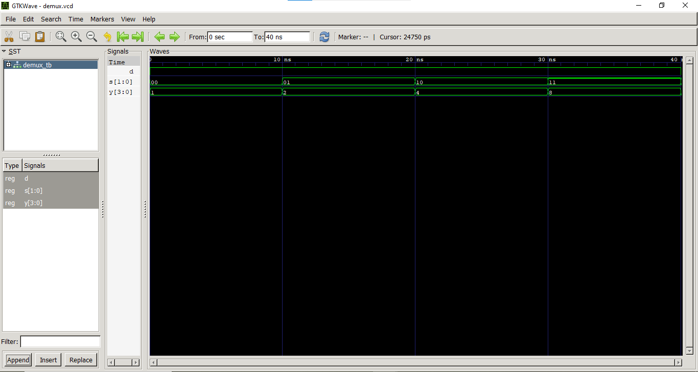

# Lab 4: VHDL Code for Combinational Circuits (MUX and DEMUX)

## Objective
* To design and simulate a 4-to-1 Multiplexer (MUX) in VHDL.
* To design and simulate a 1-to-4 Demultiplexer (DEMUX) in VHDL.

## Theory

### Multiplexer (MUX)
A multiplexer selects one of $2^n$ input data lines and routes it to a single output based on $n$ select lines. A **4-to-1 MUX** has 4 data inputs (D0–D3), 2 select lines (S1S0), and 1 output (Y).

| S1 | S0 | Y |
| :---: | :---: | :---: |
| 0 | 0 | D0 |
| 0 | 1 | D1 |
| 1 | 0 | D2 |
| 1 | 1 | D3 |

### Demultiplexer (DEMUX)
A demultiplexer routes a single input to one of $2^n$ output lines based on $n$ select lines. A **1-to-4 DEMUX** has 1 data input (D), 2 select lines (S1S0), and 4 outputs (Y0–Y3).

| S1 | S0 | Active Output |
| :---: | :---: | :---: |
| 0 | 0 | Y0 = D |
| 0 | 1 | Y1 = D |
| 1 | 0 | Y2 = D |
| 1 | 1 | Y3 = D |

---

## Output (Simulation Waveforms)

### Multiplexer (MUX) Waveform Diagram
The timing trace verifies that the multiplexer shifts its output path matching the active selection inputs. When selection vector `s` changes to `"01"`, output `y` successfully updates high to mirror input bit `d(1) = '1'`. When `s` changes to `"10"`, output `y` drops back low to track `d(2) = '0'`.

### Demultiplexer (DEMUX) Waveform Diagram
The timing simulation routes the single input data stream `D` onto the specific output lines specified by the selection lines. At the 40 ns point, toggling input data `D` to a low state correctly forces the selected active output channel low.

---

## Discussion and Conclusion

### Discussion
In this laboratory session, we successfully designed and analyzed two vital combinational routing structures: a 4-to-1 Multiplexer and a 1-to-4 Demultiplexer using VHDL behavioral descriptions. Behavioral modeling via sequential `process` statements and `case` constructs allows an intuitive implementation that closely matches hardware truth tables.

During verification in GTKWave, individual circuit performance was thoroughly assessed. For the Multiplexer, adding the output line `y` alongside the testbench values proved that it does not simply mirror the selection bits. Instead, it uses the selection lines to cleanly isolate and track a single bit from the data vector array. For the Demultiplexer, a crucial default assignment layout (`Y <= "0000";`) was initialized directly preceding the conditional case choices. This specific configuration element serves as a vital safeguard in VHDL development; it covers all unhandled combinations to completely eliminate the risk of unwanted latch inference, ensuring the synthesized hardware functions entirely as pure combinational logic.

### Conclusion
The functional characteristics of combinational MUX and DEMUX blocks were successfully mapped and validated using a GHDL execution toolchain and GTKWave. The resulting simulated waveform patterns correspond precisely with the intended logical truth tables. All expected value changes and signal constraints were met perfectly, confirming that our behavioral code accurately represents the hardware architecture.