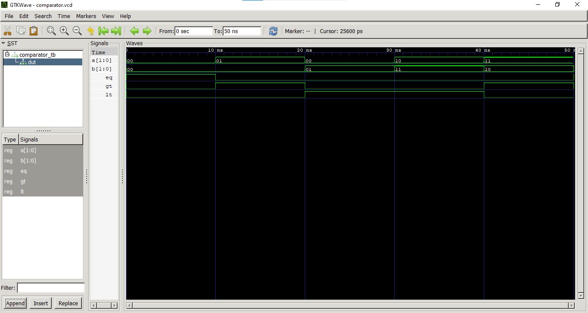

# Lab 5: VHDL Code for Combinational Circuits: Comparator

## Objective

- To design and simulate a 2-bit magnitude comparator in VHDL.
- To understand how comparison operations are implemented in hardware.
- To verify the functionality of the comparator using simulation.

---

## Theory

A **magnitude comparator** compares two binary numbers and produces three output signals:

- **EQ (Equal):** HIGH when **A = B**
- **GT (Greater Than):** HIGH when **A > B**
- **LT (Less Than):** HIGH when **A < B**

For a 2-bit comparator with inputs **A = A₁A₀** and **B = B₁B₀**:

```
EQ = (A₁ ⊙ B₁) · (A₀ ⊙ B₀)

GT = A₁B̅₁ + (A₁ ⊙ B₁) · A₀B̅₀

LT = A̅₁B₁ + (A₁ ⊙ B₁) · A̅₀B₀
```

where **⊙** represents the XNOR operation.

A magnitude comparator is a **combinational circuit**, meaning its outputs depend only on the present values of the inputs and not on any previous state.

---

## Output


### Simulation Waveform



### Observations

| A | B | EQ | GT | LT |
|---|---|----|----|----|
| 00 | 00 | 1 | 0 | 0 |
| 01 | 00 | 0 | 1 | 0 |
| 00 | 01 | 0 | 0 | 1 |
| 10 | 11 | 0 | 0 | 1 |
| 11 | 10 | 0 | 1 | 0 |

The simulation waveform confirms that:
- **EQ** is HIGH only when **A = B**.
- **GT** is HIGH only when **A > B**.
- **LT** is HIGH only when **A < B**.

---

## Discussion

The 2-bit magnitude comparator was implemented using VHDL and verified through simulation. The outputs changed correctly for each applied input combination. At every instant, only one of the three output signals (EQ, GT, or LT) became HIGH, which confirms the correct behavior of the comparator.

---

## Conclusion

The 2-bit magnitude comparator was successfully designed and simulated in VHDL. The waveform obtained from GTKWave matched the expected results, demonstrating that the comparator correctly identifies whether one input is equal to, greater than, or less than the other.
