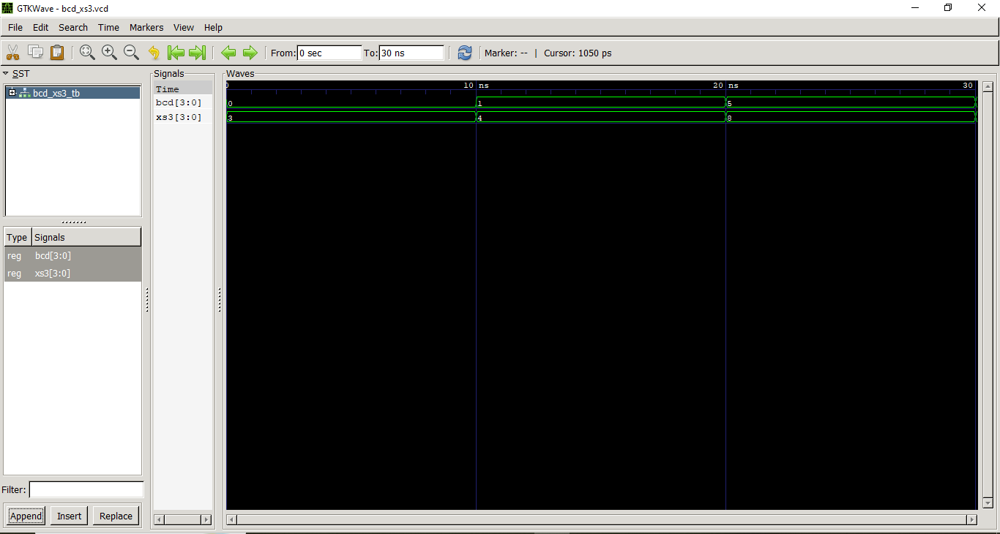
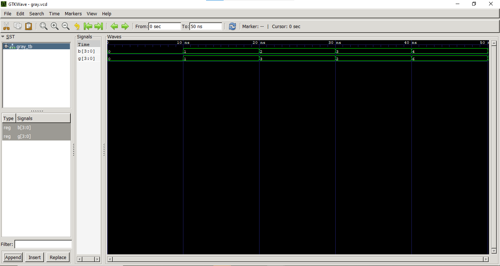

# Lab 6: VHDL Code for Combinational Circuits – Code Converter

## Objective

The objectives of this experiment are:

- To design and simulate a **BCD-to-Excess-3 Code Converter** using VHDL.
- To design and simulate a **Binary-to-Gray Code Converter** using VHDL.

---

# Theory

## BCD to Excess-3

Excess-3 (XS-3) is a **non-weighted Binary Coded Decimal (BCD)** code obtained by adding **3 (0011)** to each valid BCD digit. Since every decimal digit is represented by its BCD equivalent plus 3, the code is known as Excess-3.

It is a **self-complementing code**, which makes it useful in arithmetic circuits, digital systems, and decimal arithmetic operations.

### BCD to Excess-3 Conversion Table

| Decimal | BCD (DCBA) | Excess-3 (WXYZ) |
|---------:|:----------:|:---------------:|
| 0 | 0000 | 0011 |
| 1 | 0001 | 0100 |
| 2 | 0010 | 0101 |
| 3 | 0011 | 0110 |
| 4 | 0100 | 0111 |
| 5 | 0101 | 1000 |
| 6 | 0110 | 1001 |
| 7 | 0111 | 1010 |
| 8 | 1000 | 1011 |
| 9 | 1001 | 1100 |

---

## Binary to Gray Code

Gray code is a binary numbering system in which **two consecutive numbers differ by only one bit**. This minimizes switching errors and is widely used in rotary encoders, analog-to-digital converters, and error-sensitive digital circuits.

The conversion formula is:

```
Gi = Bi ⊕ Bi+1
```

where:

- **Gi** = Gray code bit
- **Bi** = Binary bit
- **⊕** = XOR operation

The Most Significant Bit (MSB) of the Gray code remains the same as the MSB of the binary number.

---


# Files Included

- `bcd_to_xs3.vhd` – BCD to Excess-3 Converter
- `bcd_xs3_tb.vhd` – Testbench for BCD to Excess-3
- `binary_to_gray.vhd` – Binary to Gray Converter
- `binary_gray_tb.vhd` – Testbench for Binary to Gray
- `README.md`

---


# Output

## BCD to Excess-3 Converter



---

## Binary to Gray Converter



---

# Discussion

The experiment was successfully performed by implementing two combinational logic circuits using VHDL. The BCD-to-Excess-3 converter correctly generated the Excess-3 representation by adding **0011** to each valid BCD input. Similarly, the Binary-to-Gray converter correctly produced Gray code using XOR operations between adjacent binary bits.

The simulation results observed in GTKWave matched the expected outputs from the truth tables, confirming that the VHDL implementations were correct.

This experiment also demonstrated the importance of simulation before hardware implementation. Gray code is especially useful because only one bit changes between consecutive values, reducing switching errors and glitches. Excess-3 code, being self-complementing, simplifies certain arithmetic operations and has applications in digital systems.

Overall, the experiment improved understanding of combinational circuit design, VHDL programming, testbench creation, and waveform analysis using GHDL and GTKWave.

---

# Conclusion

The objectives of the experiment were successfully achieved. Both the **BCD-to-Excess-3 Converter** and the **Binary-to-Gray Converter** were designed, implemented, and simulated using VHDL.

The generated outputs matched the expected truth tables, proving the correctness of the designs. Through this experiment, practical knowledge of combinational logic circuits, VHDL coding, simulation, and waveform verification was gained. The experiment also highlighted the significance of code converters in digital electronics and reinforced the importance of simulation in verifying digital circuit designs before hardware implementation.

---

# Result

The VHDL implementation and simulation of both the **BCD-to-Excess-3 Code Converter** and the **Binary-to-Gray Code Converter** were completed successfully. The observed outputs were correct and matched the expected results.