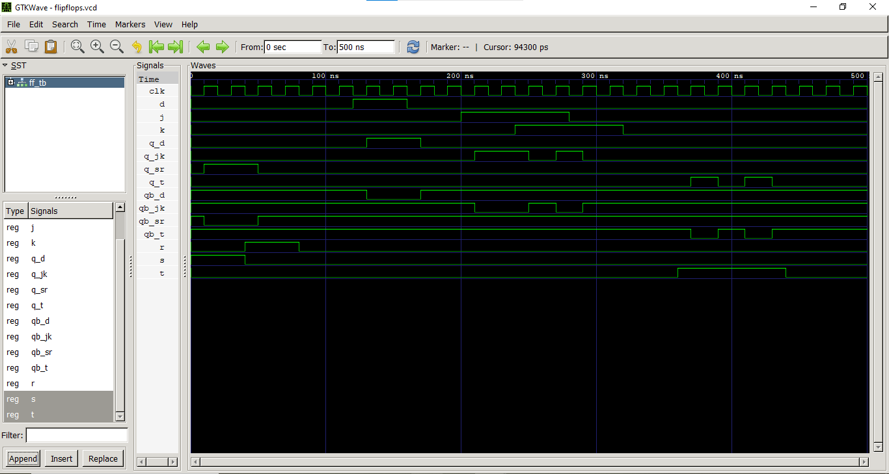

# Lab 7: VHDL Code for Sequential Circuits: Flip-Flops

## Objective

• To implement and simulate SR, D, JK, and T Flip-Flops using VHDL and verify their operation through simulation waveforms.

• To understand the role of the clock signal in sequential circuits.

---

## Theory

A **flip-flop** is a bistable sequential element—it stores one bit of state. Unlike combinational circuits, its output depends on both the current inputs and its previous state. Flip-flops are triggered by a clock signal, either on the rising edge (rising-edge) or falling edge.

### SR Flip-Flop

| S | R | Q (next) |
|---|---|----------|
| 0 | 0 | Q (no change) |
| 0 | 1 | 0 (reset) |
| 1 | 0 | 1 (set) |
| 1 | 1 | X (forbidden) |

### D Flip-Flop

The D flip-flop captures the value of **D** on the clock edge.

**Q(next) = D**

### JK Flip-Flop

The JK flip-flop eliminates the forbidden state of the SR flip-flop.

- J = 0, K = 0 → Hold
- J = 0, K = 1 → Reset
- J = 1, K = 0 → Set
- J = 1, K = 1 → Toggle

### T Flip-Flop

The T flip-flop toggles its output when **T = 1** and holds its previous state when **T = 0**.

---

## Files

- `sr_ff.vhd` – SR Flip-Flop implementation
- `d_ff.vhd` – D Flip-Flop implementation
- `jk_ff.vhd` – JK Flip-Flop implementation
- `t_ff.vhd` – T Flip-Flop implementation
- `ff_tb.vhd` – Testbench
- `flipflops_waveform.png` – Simulation waveform

---

## Output

The simulation waveform confirms the correct operation of all four flip-flops.

- The **SR Flip-Flop** performs Set, Reset, and Hold operations according to the input combinations.
- The **D Flip-Flop** copies the value of the D input to the output on each rising edge of the clock.
- The **JK Flip-Flop** correctly performs Hold, Set, Reset, and Toggle operations.
- The **T Flip-Flop** toggles its output whenever T is high and holds its state when T is low.

**Simulation Waveform:**

---

## Discussion

During this experiment, four different types of flip-flops were implemented using VHDL and simulated using GHDL and GTKWave. The generated waveforms matched the expected truth tables and verified the correct functioning of each flip-flop. The experiment also demonstrated how sequential circuits depend on both the clock signal and previous output state. The waveform analysis helped in understanding the behavior of memory elements used in digital systems.

---

## Conclusion

This lab successfully demonstrated the implementation and simulation of SR, D, JK, and T flip-flops in VHDL. The simulation results matched the expected theoretical behavior, confirming the correctness of the designs. This experiment strengthened the understanding of sequential logic circuits, clock-triggered operations, and the use of GHDL and GTKWave for VHDL simulation and verification.

---

## Result

The SR, D, JK, and T flip-flops were successfully designed, implemented, and simulated using VHDL. The generated GTKWave simulation waveforms matched the expected theoretical behavior of each flip-flop. All required operations—including Set, Reset, Hold, and Toggle—were verified successfully, confirming the correctness of the implemented sequential circuits.