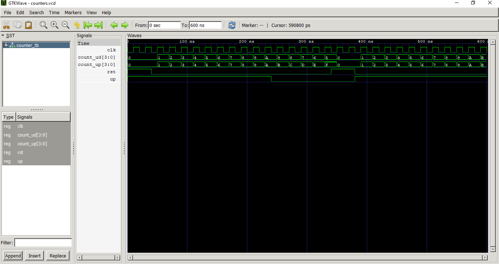

# Lab 8: VHDL Code for Sequential Circuits: Counters

## Objective

* To design and simulate a **4-bit synchronous up counter** in VHDL.
* To design and simulate a **4-bit synchronous up/down counter** in VHDL.

---

# Theory

A **counter** is a sequential digital circuit that changes its output on every clock pulse. Counters are implemented using flip-flops and are widely used in digital systems for counting events, timing applications, frequency division, and sequence generation.

In a **synchronous counter**, all flip-flops receive the same clock signal, so every bit changes simultaneously on the active clock edge. This makes synchronous counters faster and more reliable than asynchronous (ripple) counters.

### 4-bit Synchronous Up Counter

The 4-bit synchronous up counter increments its count by **1** on every rising edge of the clock. It counts from **0000 (0)** to **1111 (15)** and then automatically returns to **0000** because it is a 4-bit counter. The active-high synchronous reset (`RST`) clears the counter to **0000** whenever it is asserted.

### 4-bit Synchronous Up/Down Counter

The 4-bit synchronous up/down counter works similarly but includes an additional **UP** control signal. When **UP = '1'**, the counter increments by one on each rising clock edge. When **UP = '0'**, it decrements by one on each rising clock edge. Like the up counter, the reset signal initializes the counter to **0000**.

---

# VHDL Files

* `counter_up.vhd` – 4-bit synchronous up counter
* `counter_updown.vhd` – 4-bit synchronous up/down counter
* `counter_tb.vhd` – Testbench
* `counters.vcd` – Simulation waveform

---

# Expected Output

The waveform should show:

* Both counters reset to **0000** when `RST = '1'`.
* The **4-bit up counter** counting continuously from **0 to 15** and then wrapping back to **0**.
* The **4-bit up/down counter** counting upward when `UP = '1'`.
* The **4-bit up/down counter** reversing direction and counting downward when `UP = '0'`.
* Both counters resetting to **0000** when reset is asserted again.

---

# Output

---

# Result

The 4-bit synchronous up counter and the 4-bit synchronous up/down counter were successfully designed, simulated, and verified using GHDL and GTKWave. The waveform confirms that the up counter increments correctly on each rising clock edge, while the up/down counter changes its counting direction according to the **UP** control signal. The synchronous reset also functions as expected by clearing both counters to zero.

---

# Discussion

This experiment demonstrates the operation of synchronous sequential circuits using VHDL. Since all flip-flops share the same clock, the counters update simultaneously on each rising clock edge, reducing propagation delay compared to asynchronous counters. The simulation verifies the correct implementation of counting, direction control, and synchronous reset. These types of counters are commonly used in digital systems such as timers, event counters, digital clocks, frequency dividers, and control units.

---

# Conclusion

The objectives of the experiment were successfully achieved. The 4-bit synchronous up counter and 4-bit synchronous up/down counter operated according to their design specifications. Simulation results matched the expected behavior, confirming the correctness of the VHDL implementation.
